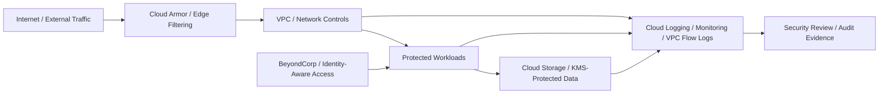

# GCP Security Study Cases - Architecture Overview

## Objective

Provide a recruiter-friendly and audit-friendly overview of how the Google
Cloud study cases relate to common cloud security architecture concerns.

This document is a conceptual portfolio map. It does not claim that a single
production architecture has been deployed, nor does it replace the case-level
evidence stored in each study folder.

## Architecture View

## Case Mapping

| Study case | Security function | Evidence focus |
| --- | --- | --- |
| Cloud Armor traffic blocklisting | Edge filtering and web-facing control | Configuration, enforcement, and traffic-control evidence |
| Cloud NGFW workload protection | Network segmentation and workload protection | Firewall policy reasoning and protected workload evidence |
| BeyondCorp Enterprise protection | Zero Trust access control | Identity-aware access and conditional access reasoning |
| CMEK with Cloud KMS | Data protection and key management | Encryption, key-control, and secrets-discipline evidence |
| Logging, Monitoring, and VPC Flow Logs | SecOps observability | Logs, monitoring views, and network-flow evidence |

## Security Rationale

The cases are organized around a layered cloud security model:

1. Reduce exposure at the edge.
2. Control network paths.
3. Restrict workload access through identity-aware controls.
4. Protect data with explicit key-management decisions.
5. Preserve observable evidence for security operations and audit review.

## Framework Alignment

| Framework | Relevant alignment |
| --- | --- |
| NIST CSF | Protect, Detect, and Govern functions through access control, monitoring, and evidence management |
| CIS Controls | Network infrastructure management, access control management, audit log management, and data protection |
| ISO 27001 | Access control, cryptography, logging, monitoring, and operational security themes |
| Zero Trust | Identity-aware access, least privilege, explicit verification, and visibility |

## Evidence Standard

Each case should preserve:

- Objective and scope.
- Configuration evidence.
- Enforcement or validation evidence.
- Log or monitoring evidence where applicable.
- Security rationale and limitations.
- Sanitized screenshots only, with no secrets, private project identifiers, or personal data.

## Limitations

- This is not a production reference architecture.
- Case-level evidence remains authoritative over this overview.
- Public documentation intentionally avoids secrets, private project IDs, billing details, and organization-specific data.
